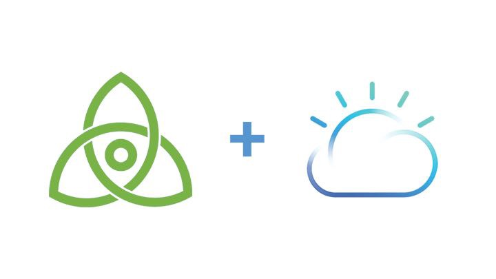
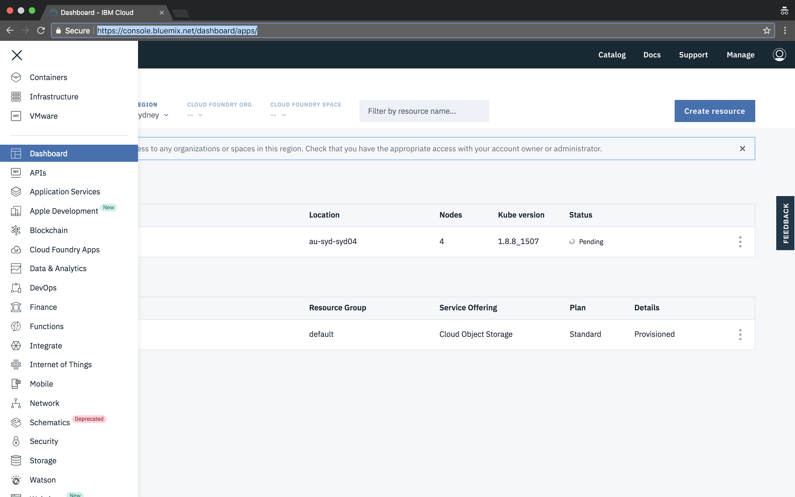
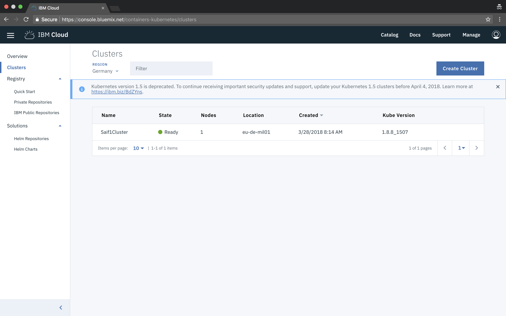
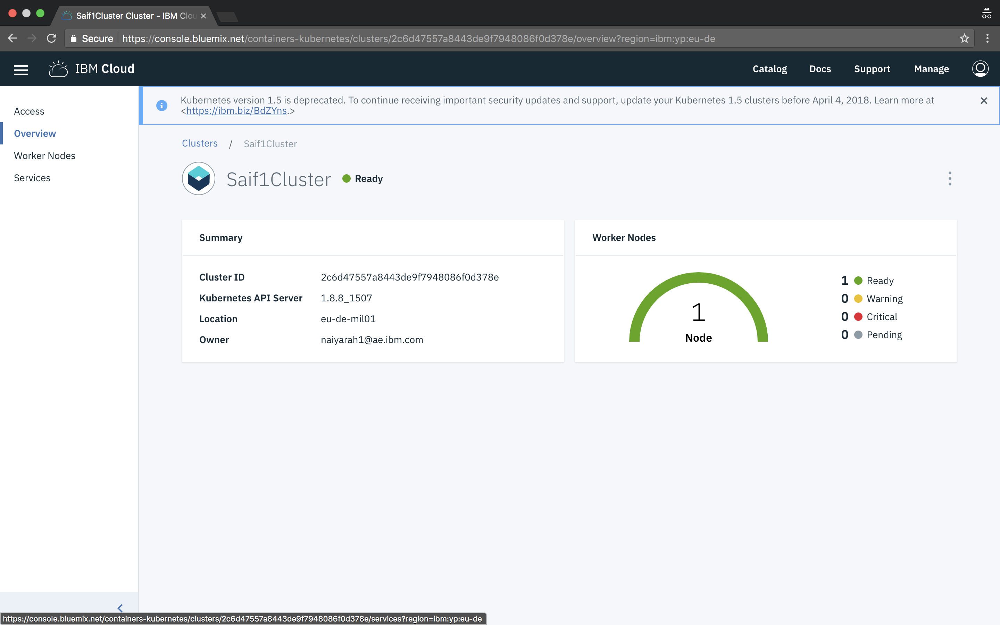

## Learning objectives

The aim of this tutorial is to show you how to easily deploy Proof of Stake Blockchain to IBM Container as 2 validator node using Tendermint and LotionJs

## Prerequisites

* Install IBM Cloud CLI, see the [IBM Cloud documentation](https://console.bluemix.net/docs/cli/reference/bluemix_cli/get_started.html)
* Install Docker, see the [Docker documentation](https://docs.docker.com/engine/installation/)
* Install and Setup Kubectl, see the [Kubernetes documentation](https://kubernetes.io/docs/tasks/tools/install-kubectl/)

## Estimated time

It will take around 60 minutes roughly to deploy 2 validator node to IBM Cloud.

## Introduction
Blockchain is one the greatest technological innovations since the Internet. The Internet empowers free flow of information, while the Blockchain empowers frictionless flow of value. Companies from various disciplines are now adopting Blockchain for real-world business use cases. The amount of research going on in applied cryptography is unprecedented. We are right now experiencing the largest civilian deployment of public key cryptography ever, and that is the Bitcoin.
While Blockchain is very interesting technology, it is also nascent. It is challenging to do a rapid prototype of a blockchain application and run it on Cloud. Tendermint allows you to rapidly create Blockchain application as it handles the underlying blockchain layers such as networking and consensus, and allows the developer to only focus on application layer through ABCI (Application Blockchain Interface)
In this blog post, I will show you how to easily create a Blockchain chat application and deploy it to cloud using Tendermint and Lotionjs

### What is Tendermint?

To simply put Tendermint is a software which can be used to achieve Byzantine fault tolerance (BFT) in any distributed computing platforms. From managing infrastructure to designing a distributed database, we can use Tendermint. Tendermint is built on 2 important technical components.
**Consensus Engine:** Also known as Tendermint core, this ensures that each transaction is recorded in every machine in the same order through Proof of Stake consensus.
**ABCI (Application Blockchain Interface):** Enables transaction to be processed in any programming language.

### Properties of Tendermint
* **Byzantine Fault-Tolerant:** Tendermint tolerates up to one third of your machines failing arbitrarily. This includes explicitly malicious behaviour.
* **State Machine Replication:** Tendermint can replicate deterministic state machines written in any programming language.
* **Secure P2P:** Gossip protocols and peer discovery are secured via Tendermint’s authenticated encryption system.
* **Lightning Fast:** Tendermint supports thousands of transaction per second at 1000ms latencies.

### What is Lotionjs
Lotion is a new way to create blockchain apps in JavaScript, which aims to make writing new blockchains fast and fun. It builds on top of Tendermint using the ABCI protocol.

## Steps

### Setting up the project

1. Create a new directory and navigate to it.

```
$ mkdir blockchain
$ cd blockchain
```
2. Install required libraries
```
$ npm i lotion --save
$ npm i dotenv --save
``` 
 ### Creating private key and genesis file of 2 validator node

 1. Create genesis file
 ```
 touch genesis.json
 ``` 
 2. Populate initial content to genesis.json
 ```
 {
    "genesis_time": "0001-01-01T00:00:00Z",
    "chain_id": "name",
    "validators": [
    ],
    "app_hash": ""
}
 ```
3. Generate keys of 2 validator node
```
$ ./node_modules/lotion/bin/tendermint gen_validator > privkey0.json
$ ./node_modules/lotion/bin/tendermint gen_validator > privkey1.json
```
4. How private key looks like, it has public and private key randomly generated
```
{
	"address": "B809574EC51377DE48454094BF3302989CBB50A9",
	"pub_key": {
		"type": "ed25519",
		"data": "8A049817BA6D1B065C30D927A529AAFA7147BE0D147E1CCD7A25FAADBE80C8D0"
	},
	"priv_key": {
		"type": "ed25519",
		"data": "57BAFDD6136E1140FA9F906313BF2CFC75802F044704DD7AAF30BC1010E6519C8A049817BA6D1B065C30D927A529AAFA7147BE0D147E1CCD7A25FAADBE80C8D0"
	}
}
```
5. Copy only public key information and paste in genesis.json, this how it will look like in the end after adduing two validators
```
{
    "genesis_time": "0001-01-01T00:00:00Z",
    "chain_id": "name",
    "validators": [
        {
            "pub_key": {
                "type": "ed25519",
                "data": "8A049817BA6D1B065C30D927A529AAFA7147BE0D147E1CCD7A25FAADBE80C8D0"
            },
            "power": 10,
            "name": "saif"
        },
        {
            "pub_key": {
                "type": "ed25519",
                "data": "5FD1FBF59759E50BD1C23911E832198AB78A4F7E6F1F23A64AAFEC5992608CA8"
            },
            "power": 20,
            "name": "prerna"
        }
    ],
    "app_hash": ""
}
```

### Building 2 validator nodes

#### Validator 1

1. Create node1 folder
```
mkdir node1
``` 
2. Navigate to node1 directory
```
cd node1
```
3. Install required libraries
```
$ npm i lotion --save
$ npm i dotenv --save
``` 
4. Copy ```genesis.json``` and ```privkey0.json``` generated before to node1 folder 
5. Create environment file of node1
```
$ touch .env-node1
```
6. Code content of node1.js
```
LOTION_HOME="./.lotion_node1"
```
7. Create node1.js 
```
$ touch node1.js
```
8. Code content of node1.js
```JavaScript
require('dotenv').config({path: ".env-node1"});
let lotion = require('lotion')
let app = lotion({
  genesis: './genesis.json',
  tendermintPort: 30090,
  initialState: { messages: [] },
  p2pPort: 30092,
  logTendermint: true,
  keys: 'privkey0.json',
  peers: ['workernode2:30092']
})
app.use((state, tx,chainInfo) => {
  if (typeof tx.sender === 'string' && typeof tx.message === 'string') {
    state.messages.push({ sender: tx.sender, message: tx.message })
  }
})
app.listen(3000).then(({ GCI }) => {
  console.log(GCI)
})
```
9.  Create Dockerfile
```
$ touch Dockerfile
```
10. Code content of Dockerfile
```Dockerfile
FROM node:carbon
WORKDIR /usr/src/app
COPY package*.json ./
COPY privkey0.json ./
COPY .env-node1 ./
RUN npm install
COPY . .
EXPOSE 30090 30092
CMD [ "node", "node1.js" ]
```

#### Validator 2

1. Create node1 folder
```
mkdir node2
``` 
2. Navigate to node1 directory
```
cd node2
```
3. Install required libraries
```
$ npm i lotion --save
$ npm i dotenv --save
``` 
4. Copy ```genesis.json``` and ```privkey1.json``` generated before to node1 folder 
5. Create environment file of node1
```
$ touch .env-node2
```
6. Code content of node2.js
```
LOTION_HOME="./.lotion_node2"
```
7. Create node1.js 
```
$ touch node2.js
```
8. Code content of node2.js
```JavaScript
require('dotenv').config({path: ".env-node2"});
let lotion = require('lotion')
let app = lotion({
  genesis: './genesis.json',
  tendermintPort: 30090,
  initialState: { messages: [] },
  p2pPort: 30092,
  logTendermint: true,
  keys: 'privkey1.json',
  peers: ['workernode1:30092']
})
app.use((state, tx,chainInfo) => {
  if (typeof tx.sender === 'string' && typeof tx.message === 'string') {
    state.messages.push({ sender: tx.sender, message: tx.message })
  }
})
app.listen(3000).then(({ GCI }) => {
  console.log(GCI)
})
```
9.  Create Dockerfile
```
$ touch Dockerfile
```
10. Code content of Dockerfile
```Dockerfile
FROM node:carbon
WORKDIR /usr/src/app
COPY package*.json ./
COPY privkey0.json ./
COPY .env-node1 ./
RUN npm install
COPY . .
EXPOSE 30090 30092
CMD [ "node", "node2.js" ]
```
### Deploying two validator nodes on IBM Cloud
1. Signup to [IBM Cloud](http://ibm.biz/ioblockchain)
2. Install [Cloud Foundry CLI](https://docs.cloudfoundry.org/cf-cli/install-go-cli.html)
3. Install [Bluemix CLI](https://console.bluemix.net/docs/cli/reference/bluemix_cli/get_started.html#getting-started)
4. Install [Kubernetes CLI](https://kubernetes.io/docs/user-guide/prereqs/)

5. Navigate to node1 directory 
```
$ cd node1
```
6. build docker image
``` 
$ docker build -t node1 .
```
7. Go to [IBM Cloud console](https://console.bluemix.net/dashboard/apps/)
8. Navigate to containers


9. Click on create new cluster


10. Name your cluster and create a cluster, wiat for few minutes to get it fully deployed. After it is fully deployed click on the cluster

 
* This shows overview of your deployed cluster 
11. Click on Access tab and follow the instruction on the website
12. Install the container service plugin.
```
$ bx plugin install container-service -r Bluemix
```
13. Log in to your IBM Cloud account.
```
$ bx login -a https://api.eu-de.bluemix.net
$ bx cs region-set eu-central
```
14. Set the context for the cluster in in your CLI.
* Get the command to set the environment variable and download the Kubernetes configuration files.
```
$ bx cs cluster-config NameOfYourCluster
```
* Set the KUBECONFIG environment variable. Copy the output from the previous command and paste it in your terminal. The command output should look similar to the following.
15.  Verify that you can connect to your cluster by listing your worker nodes
```
$  kubectl get nodes
```
16. Go to your [IBM Cloud Registery](https://console.bluemix.net/containers-kubernetes/registry/private)
17. Choose a name for your first namespace, and create that namespace.
```
$ bx cr namespace-add <my_namespace>
```
18. Log your local Docker daemon into the IBM Cloud Container Registry.
```
$ bx cr login
```
19. Choose a repository and tag by which you can identify the image. Use the same repository and tag for the rest of this Quick Start.
```
$ docker tag node1 <registery>/<my_namespace>/node1:latest
```
20. Push the image.
```
$ docker push <registery>/<my_namespace>/node1:latest
```
21. Verify that your image is in your private registry.
```
$ bx cr image-list
```
22. Now your container is deployed on IBM Container, it is time to spin up some pods using kubernetes
* Change image name accordinglly from private name of your registry, just copy/paste :)
```YAML
apiVersion: extensions/v1beta1
kind: Deployment
metadata:
 name: tendermintnodeone # give any name
spec:
 replicas: 1
 template:
   metadata:
     name: tendermintnodeone
     labels:
       run: tendermint1
   spec:
     containers:
       - name: saif1cluster
         image: "<registery>/<my_namespace>/node1:latest" # your registery name
         imagePullPolicy: Always
---
apiVersion: v1
kind: Service
metadata:
 name: my-service-tendermint-11 # give a service name
 labels:
   run: tendermint1
spec:
 type: NodePort
 selector:
   run: tendermint1
 ports:
  - protocol: TCP
    name: tendermint1
    port: 30090  
    nodePort: 30090  
  - protocol: TCP
    name: port
    port: 30092  
    nodePort: 30092 
```
23. Configure Kubernetes, to create pods, services, and deployments
```
$ kubectl create -f service-deployment.yml
```
24. delete all deployments
```
$ kubectl delete deployments --all 
```
25. delete all services
```
$ kubectl delete services --all 
```
26. Follow same procesdure with node2 with different name
27. Access pods and logs
```
$ kubectl get pods
$ kubectl logs podname
```
28. Access Tendermint RPC Apis ``` http://workerip:30092 ```
> repeat the same steps for node2

### Light client to read/write on our Blockchain
1. Install ```lotion-connect```
```
$ npm install lotion-connect --save
```
2. Create write.js
```
$ touch read-write.js
```
3. Code content of read-write.js
```JavaScript
let { connect } = require('lotion-connect')
async function main() {
let { state, send } = await connect(null, { 
  genesis: require('./genesis.json'),
  nodes: [ 'ws://wordernode1:30092','ws://wordernode2:30092' ]
})
console.log(await state)
console.log(await send({ "sender": 'saif',"message":"himom" }))
  process.exit();
}
main()
```
## Summary

Tendermint has made it easy for business developers to write blockchain applications, and the IBM Cloud made it easy to deploy and operate such applications. I look forward to seeing your blockchain applications!

## References

* [Tendermint Docs](http://tendermint.readthedocs.io/projects/tools/en/master/)
* [Creating End-to-End Tendermint blockchain chat app](https://medium.com/coinmonks/deploying-proof-of-stake-blockchain-applications-on-ibm-cloud-using-tendermint-8544a0185d84)
* [Tendermint Blockchain Chat App Github Repo](https://github.com/SaifRehman/tendermint-chat-app)

